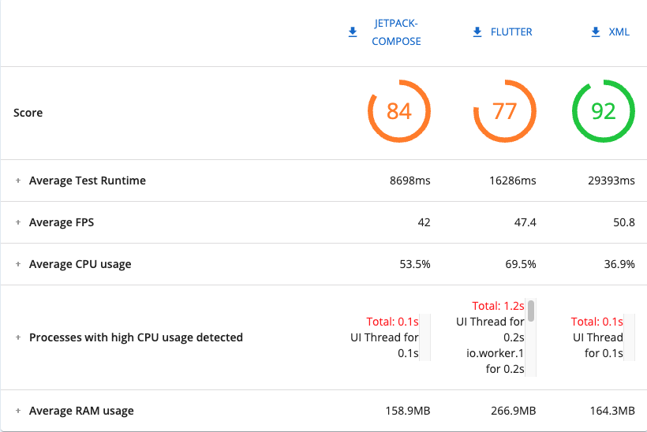

# XML vs Jetpack-Compose vs Flutter

#### Jetpack-Compose version of the app

## App

The application contains a list of 100 statically created objects, when clicking on an item in the list, there is an animated transition to the detailed screen.
When entering the detail screen, the picture frame rotates for two seconds. If the user scrolls the text, the photo and the text
moves at the same time, the background shrinks and a button appears.
## Directory structure

    .
    ├── shared                 # Shared code (Jetpack-Compose & XML).
    ├── compose                # Jetpack-Compose UI code.
    │   └── benchmark          # Macrobenchmark Compose.
    ├── xml                    # XML UI code.
    │   └── benchmark          # Macrobenchmark XML.
    ├── app_flutter            # Flutter module.
    │   └── lib                # Flutter source code.
    │   └── integration_test   # Flutter Integration tests.
    └── tests                  # Test Results and Scripts.
---
## Device

All tests were performed on a physical device.

* **Physical Device**:  Samsung Galaxy A52
* **OS**:               Android 13 (API 33)
* **RAM**:              6 GB
* **CPU-Cores**:        8

---
## Tests
#### App Frame timing
The scroll tests were run five times and the results are based on the data from the five tests.

Macrobenchmark tests were written for XML & Jetpack-Compose to obtain frame timing data while scrolling the list: `./compose/benchmark/src/main/java/com/example/benchmark/FrameTimingBenchmark.kt`,
`./xml/benchmark/src/main/java/com/example/benchmark/FrameTimingBenchmark.kt`

The integration test was written for Flutter:
`./app_flutter/integration_test/scroll_trace_test.dart`
After running the test for Flutter, a file with various performance data in JSON `./tests/list_scroll/flutter`
format was obtained and the value of `frame_rasterizer_times` was taken for the tests. Then using a Python script `./tests/percentile_script/script.py`
the average frame timing in each percentile [50,90,95,99] was obtained `./tests/percentile_script/results_from_script`.

#### App startup Time
Tests to obtain application startup time data were performed five times.

Macrobenchmark tests were written to obtain the startup time for XML & Jetpack-Compose app:
`./compose/benchmark/src/main/java/com/example/benchmark/StartupBenchmark.kt`,
`./xml/benchmark/src/main/java/com/example/benchmark/StartupBenchmark.kt`.
The cold startup type was taken for comparison.

The startup time of the Flutter application was obtained using a command in the terminal:
<pre>
flutter run --trace-startup --profile
</pre>
This command is necessary to obtain the startup time of the app
[Measuring app startup time](https://docs.flutter.dev/testing/debugging#measuring-app-startup-time).
An JSON `tests/app_startup_iter_5/flutter_startup_5_iter` file was obtained and the value `timeToFirstFrameRasterizedMicros` was taken. The tests were run five times and obtained
maximum, minimum and median startup times for the app.

#### Benchmark app using a Flashlight

The `./tests/app_interaction_script` was written and the tests were run ten times on a physical device.
Using the `Flashlight` library, application performance data, average FPS, CPU, RAM and an overall score on a scale of 100 were obtained.

* [Marcobenchmarks](https://developer.android.com/topic/performance/benchmarking/macrobenchmark-overview)

* [Integration testing](https://docs.flutter.dev/testing/integration-tests)

* [Flashlight](https://github.com/bamlab/flashlight)

---

## Results

### Performance benchmark using a Flashlight

### App Frame timing

| Percentile | XML | Jetpack-Compose | Flutter |
|:-----------|:----|:---------------:|--------:|
| p50        | 5.2 |       7.6       |     5.2 |
| p90        | 6.6 |      12.0       |     7.1 |
| p95        | 7.0 |      14.8       |     8.6 |
| p99        | 7.7 |      23.3       |   48.18 |

`./tests/list_scroll`

### App Size

| Flutter |  Jetpack-Compose  | XML    |
|---------|:-----------------:|--------|
| 13 Mb   |      12.7 Mb      | 5.5 Mb |

`./tests/app_size`

### App Startup Time

|        | XML   | Jetpack-Compose | Flutter |
|:-------|:------|:---------------:|--------:|
| min    | 670.8 |      570.5      |     337 |
| median | 707.5 |      591.1      |   395.9 |
| max    | 729.1 |      620.2      |   502.6 |

`./tests/app_startup_iter_5`

